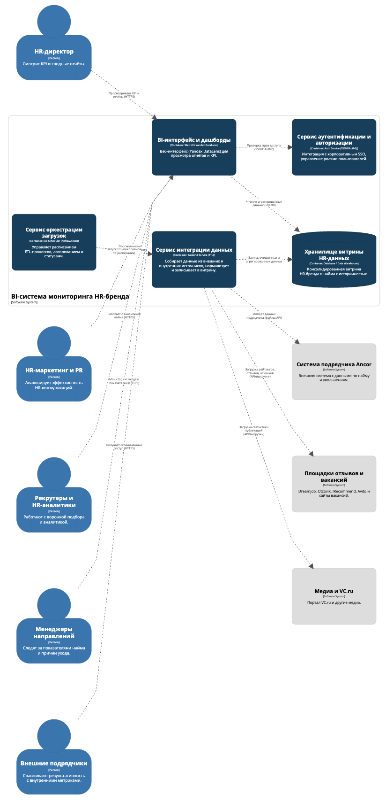
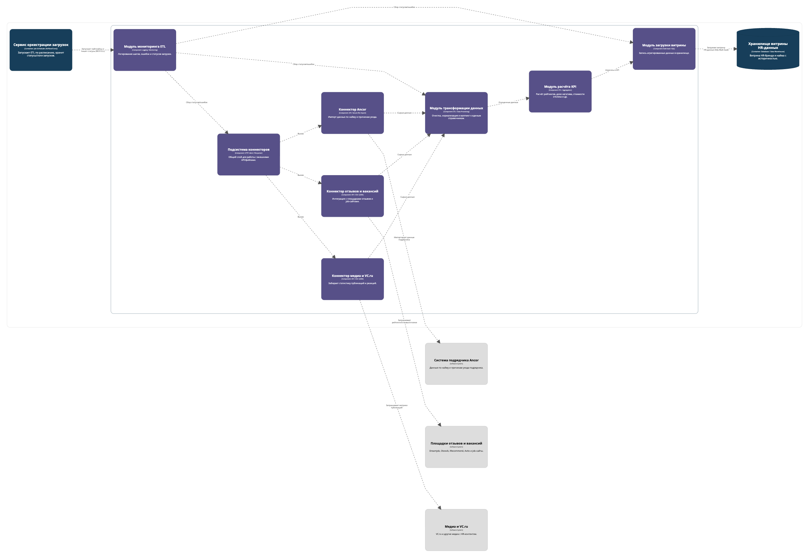
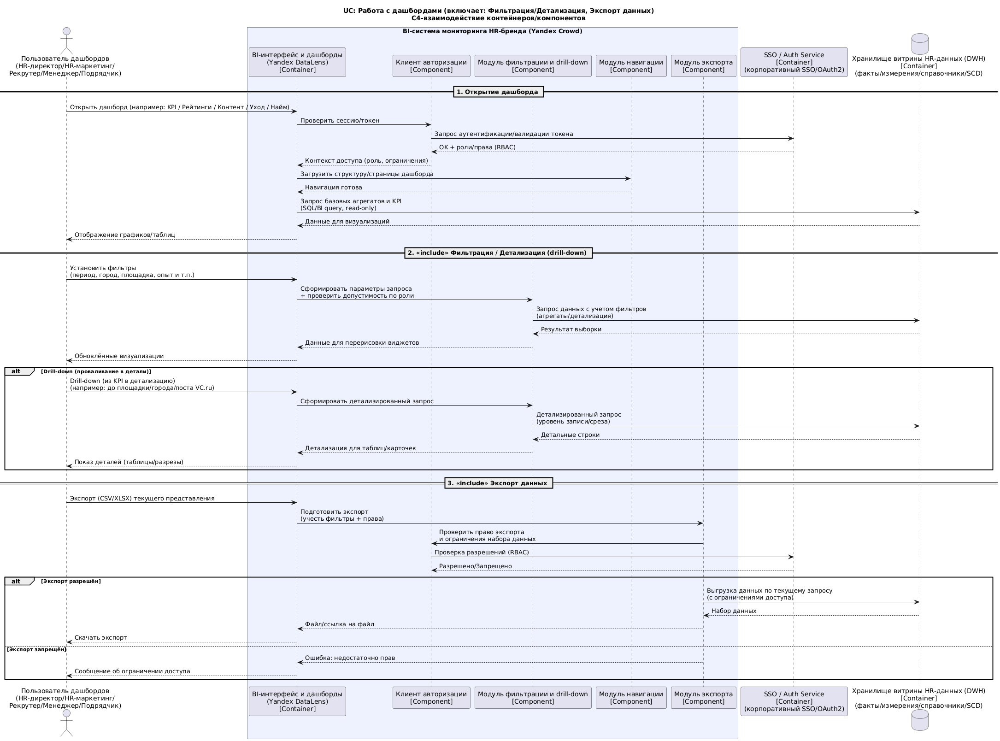
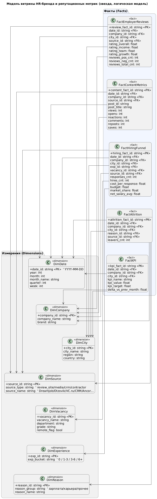

# Лабораторная работа №3
**Тема:** Использование принципов проектирования на уровнях методов и классов  
**Цель работы:** Получить опыт проектирования и реализации модулей с использованием принципов KISS, YAGNI, DRY, SOLID и др.

## Диаграмма контейнеров


## Диаграмма компонентов для одного контейнера


## Диаграмма компонентов для остальных контейнеров


## Диаграмма последовательностей


### Краткие пояснения к диаграмме

#### Цель сценария
Диаграмма отражает реализацию варианта использования «Работа с дашбордами», который включает два под--сценария:
1.  **Фильтрация/детализация (drill-down)** — интерактивный анализ метрик (периоды, города, площадки, опыт кандидата, источники и т.д.).
2.  **Экспорт данных** — выгрузка текущего среза данных для внешнего анализа и отчётности.

#### Участники и их роли
*   **Пользователь дашбордов (actor):** один из бизнес-пользователей (HR-директор, HR-маркетинг, рекрутер и т.д.).
*   **BI-интерфейс и дашборды (Container, DataLens):** слой визуализации; инициирует запросы к витрине, управляет отображением, вызывает компоненты фильтрации и экспорта.
*   **Клиент авторизации (Component):** компонент внутри UI, который отвечает за проверку токена/сессии и получение ролей пользователя.
*   **Модуль фильтрации и drill-down (Component):** формирует параметры запросов на основе фильтров, выполняет проверку допустимости фильтров по роли и инициирует выборку данных.
*   **Модуль навигации (Component):** обеспечивает переходы между дашбордами и сценариями (например, из KPI-панели в подробный отчёт).
*   **Модуль экспорта (Component):** формирует выгрузку (CSV/XLSX) с учётом активных фильтров и прав доступа.
*   **SSO/Auth Service (Container):** внешняя/корпоративная служба аутентификации и авторизации (RBAC).
*   **Хранилище витрины HR-данных (DWH/Container):** единая витрина с историчностью, справочниками и фактами; источник данных для всех визуализаций и экспорта.

#### Логика сценария
1.  **Открытие дашборда**
    *   Пользователь открывает дашборд в интерфейсе DataLens.
    *   UI проверяет сессию через AuthClient, получает роли/права из SSO.
    *   UI загружает структуру дашборда (навигация) и выполняет базовый запрос к витрине DWH.
    *   Пользователю отображаются графики и таблицы.

2.  **Фильтрация и детализация (include)**
    *   Пользователь задаёт фильтры (период, город, источник и т.д.).
    *   Filter формирует параметры запроса, учитывает ограничения по роли пользователя.
    *   DWH возвращает данные, UI обновляет визуализации.
    *   В режиме drill-down выполняется детализированный запрос (до площадки/города/поста/среза), и UI показывает подробные таблицы.

3.  **Экспорт данных (include)**
    *   Пользователь инициирует экспорт текущего представления.
    *   ExportMod проверяет права экспорта через AuthClient → SSO.
    *   Если экспорт разрешён — выполняется выгрузка из DWH с учётом фильтров/ограничений и пользователь получает файл/ссылку.
    *   Если запрещён — UI показывает сообщение о недостаточных правах.

## Диаграмма классов (модель БД)


### Краткие пояснения к модели

#### Что это за модель
Диаграмма описывает логическую модель витрины данных (Data Mart) в стиле звёздной схемы (Star Schema). Такой подход удобен для BI: фактовые таблицы хранят измеримые показатели (метрики), а измерения — справочники для разрезов анализа (время, город, источник и т.д.).

#### Измерения (Dimensions)
*   **DimDate** — календарное измерение для помесячной/понедельной динамики и сравнения периодов.
*   **DimCompany** — компания/бренд (в т.ч. для сравнения “Яндекс Крауд” vs. подрядчик при необходимости).
*   **DimCity** — география для разрезов по городам/регионам.
*   **DimSource** — источник данных (площадки отзывов, VC.ru, CRM, Ancor).
*   **DimVacancy** — справочник вакансий/направлений (для воронки найма).
*   **DimExperience** — “бакеты” опыта кандидатов (0, 1–3, 3–6, 6+).
*   **DimReason** — справочник причин ухода (зарплата/карьера/прочее и детализация).

#### Факты (Facts)
*   **FactEmployerReviews** — факты по рейтингам и отзывам: общий рейтинг, частные оценки, количество позитив/негатив.
*   **FactContentMetrics** — метрики контента/публикаций (просмотры, реакции, комментарии и т.д.).
*   **FactHiringFunnel** — показатели найма и откликов: отклики, наймы, стоимость отклика, бюджеты, доля рынка и т.п.
*   **FactAttrition** — показатели текучести/уходов по причинам и источнику (в т.ч. сравнение с Ancor).
*   **FactKPI** — агрегированная KPI-панель (факт/цель/дельта к прошлому месяцу), ускоряет загрузку ключевого дашборда.

## Клиентский и серверный код с учётом принципов KISS, YAGNI, DRY и SOLID

### Сервер (API для данных и экспорта)

#### 1) SOLID + DRY: разделяем ответственность, вводим интерфейсы
*   **SRP:** AuthService проверяет права, QueryService строит запрос, Repository общается с DWH.
*   **DIP:** контроллер зависит от абстракций (interfaces), а не от конкретного DWH.
*   **DRY:** одна функция нормализации фильтров, один метод проверки прав.

```python
from dataclasses import dataclass
from typing import Protocol, Literal, Optional, Dict, Any, List
from fastapi import FastAPI, Depends, HTTPException

app = FastAPI()

Role = Literal["HR_DIRECTOR", "HR_MARKETING", "RECRUITER", "MANAGER", "VENDOR"]

@dataclass(frozen=True)
class UserContext:
    user_id: str
    role: Role

@dataclass(frozen=True)
class Filters:
    date_from: str
    date_to: str
    city_id: Optional[str] = None
    source_id: Optional[str] = None
    exp_bucket: Optional[str] = None

class DwhRepository(Protocol):
    def fetch_kpi(self, company_id: str, filters: Filters) -> List[Dict[str, Any]]: ...
    def fetch_reviews(self, company_id: str, filters: Filters) -> List[Dict[str, Any]]: ...
    def export_rows(self, dataset: str, company_id: str, filters: Filters) -> List[Dict[str, Any]]: ...

class AuthGateway(Protocol):
    def validate_token(self, token: str) -> UserContext: ...
    def can_export(self, ctx: UserContext) -> bool: ...
    def allowed_filters(self, ctx: UserContext) -> set[str]: ...

def normalize_filters(raw: Dict[str, Any]) -> Filters:
    # DRY: единая нормализация/валидация входных фильтров
    return Filters(
        date_from=raw["date_from"],
        date_to=raw["date_to"],
        city_id=raw.get("city_id"),
        source_id=raw.get("source_id"),
        exp_bucket=raw.get("exp_bucket"),
    )

class SimpleAuthService:
    # KISS: простая проверка прав
    def __init__(self, gateway: AuthGateway):
        self._gw = gateway

    def get_context(self, token: str) -> UserContext:
        return self._gw.validate_token(token)

    def ensure_export_allowed(self, ctx: UserContext) -> None:
        if not self._gw.can_export(ctx):
            raise HTTPException(status_code=403, detail="Export forbidden for this role")

    def ensure_filters_allowed(self, ctx: UserContext, raw_filters: Dict[str, Any]) -> Filters:
        allowed = self._gw.allowed_filters(ctx)
        for key in raw_filters.keys():
            if key not in allowed:
                raise HTTPException(status_code=400, detail=f"Filter '{key}' is not allowed for role")
        return normalize_filters(raw_filters)

class QueryService:
    # SRP: только подготовка логики “какие данные нужны”
    def __init__(self, repo: DwhRepository):
        self._repo = repo

    def get_kpi(self, company_id: str, filters: Filters):
        return self._repo.fetch_kpi(company_id, filters)

    def get_reviews(self, company_id: str, filters: Filters):
        return self._repo.fetch_reviews(company_id, filters)

    def export(self, dataset: str, company_id: str, filters: Filters):
        return self._repo.export_rows(dataset, company_id, filters)
```

#### 2) KISS + YAGNI: один унифицированный endpoint под дашборды
Не делаем десяток отдельных endpoint’ов "на всякий случай" (YAGNI).  
Делаем минимально нужное: kpi, reviews, hiring, attrition, content, export.

```python
def get_repo() -> DwhRepository:
    raise NotImplementedError

def get_auth_gateway() -> AuthGateway:
    raise NotImplementedError

def get_auth_service(gw: AuthGateway = Depends(get_auth_gateway)) -> SimpleAuthService:
    return SimpleAuthService(gw)

def get_query_service(repo: DwhRepository = Depends(get_repo)) -> QueryService:
    return QueryService(repo)

@app.post("/api/dashboard/{dataset}")
def dashboard_data(
    dataset: Literal["kpi", "reviews"],
    company_id: str,
    filters: Dict[str, Any],
    token: str,
    auth: SimpleAuthService = Depends(get_auth_service),
    qs: QueryService = Depends(get_query_service),
):
    ctx = auth.get_context(token)
    f = auth.ensure_filters_allowed(ctx, filters)

    if dataset == "kpi":
        return {"items": qs.get_kpi(company_id, f)}
    if dataset == "reviews":
        return {"items": qs.get_reviews(company_id, f)}

    # KISS: явный guard, без сложных цепочек
    raise HTTPException(status_code=404, detail="Unknown dataset")

@app.post("/api/export/{dataset}")
def export_data(
    dataset: Literal["kpi", "reviews"],
    company_id: str,
    filters: Dict[str, Any],
    token: str,
    auth: SimpleAuthService = Depends(get_auth_service),
    qs: QueryService = Depends(get_query_service),
):
    ctx = auth.get_context(token)
    auth.ensure_export_allowed(ctx)
    f = auth.ensure_filters_allowed(ctx, filters)

    rows = qs.export(dataset, company_id, f)
    return {"rows": rows, "format": "csv"}
```

#### Где применены принципы:
*   **KISS:** простые endpoint’ы, явные проверки и т.д.
*   **YAGNI:** поддерживаем только dataset’ы, которые есть в ВКР/дашбордах; не добавляем лишние.
*   **DRY:** `normalize_filters()` + единая проверка allow-list фильтров/ролей.
*   **SOLID:** SRP (Auth/Query/Repo), DIP (Protocol), OCP частично (можно расширять dataset через новые методы репозитория без переписывания auth-логики).

### Клиент (UI / "AuthClient + FilterModule + ExportModule")

#### 1) DRY + KISS: единый клиент запросов и единый "buildFilters"

```python
type Role = "HR_DIRECTOR" | "HR_MARKETING" | "RECRUITER" | "MANAGER" | "VENDOR";

type UserContext = { userId: string; role: Role; token: string };

type Filters = {
  date_from: string;
  date_to: string;
  city_id?: string;
  source_id?: string;
  exp_bucket?: string;
};

class ApiClient {
  constructor(private readonly baseUrl: string) {}

  async post<T>(path: string, body: unknown): Promise<T> {
    const res = await fetch(`${this.baseUrl}${path}`, {
      method: "POST",
      headers: { "Content-Type": "application/json" },
      body: JSON.stringify(body),
    });
    if (!res.ok) throw new Error(`API error: ${res.status}`);
    return (await res.json()) as T;
  }
}

// DRY: фильтры собираем в одном месте
function buildFilters(uiState: any): Filters {
  return {
    date_from: uiState.dateFrom,
    date_to: uiState.dateTo,
    city_id: uiState.cityId ?? undefined,
    source_id: uiState.sourceId ?? undefined,
    exp_bucket: uiState.expBucket ?? undefined,
  };
}
```

#### 2) SOLID (SRP) и логика из компонентов
*   **AuthClient:** простые endpoint’ы, явные проверки и т.д.
*   **FilterModule:** только формирование запроса и загрузка данных.
*   **ExportModule:** только экспорт.

```python
class AuthClient {
  // SRP: не ходит за данными, только хранит/обновляет контекст доступа
  constructor(private ctx: UserContext) {}

  get token() { return this.ctx.token; }
  get role() { return this.ctx.role; }

  // YAGNI: не реализуем "супер-SDK" авторизации, только то, что нужно дашбордам
  canExport(): boolean {
    return this.ctx.role !== "VENDOR";
  }
}

class FilterModule {
  constructor(private api: ApiClient, private auth: AuthClient) {}

  async loadDataset(dataset: "kpi" | "reviews", companyId: string, filters: Filters) {
    // KISS: один вызов, простое тело
    return this.api.post<{ items: any[] }>(`/api/dashboard/${dataset}`, {
      company_id: companyId,
      filters,
      token: this.auth.token,
    });
  }
}

class ExportModule {
  constructor(private api: ApiClient, private auth: AuthClient) {}

  async exportDataset(dataset: "kpi" | "reviews", companyId: string, filters: Filters) {
    if (!this.auth.canExport()) {
      throw new Error("Export forbidden for this role");
    }
    return this.api.post<{ rows: any[]; format: string }>(`/api/export/${dataset}`, {
      company_id: companyId,
      filters,
      token: this.auth.token,
    });
  }
}

3) Пример "дашборда" (как компонент использует модули)
async function onApplyFilters(uiState: any) {
  const api = new ApiClient("https://bi.example");
  const auth = new AuthClient(uiState.userContext);
  const filterModule = new FilterModule(api, auth);

  const filters = buildFilters(uiState);
  const companyId = uiState.companyId;

  // KISS: прямой сценарий "применили фильтры → перерисовали"
  const kpi = await filterModule.loadDataset("kpi", companyId, filters);
  renderKpi(kpi.items);
}

async function onExport(uiState: any) {
  const api = new ApiClient("https://bi.example");
  const auth = new AuthClient(uiState.userContext);
  const exportModule = new ExportModule(api, auth);

  const filters = buildFilters(uiState);
  const companyId = uiState.companyId;

  const exported = await exportModule.exportDataset("kpi", companyId, filters);
  downloadAsCsv(exported.rows);
}
```

## Применимость принципов разработки

### 1. BDUF — Big Design Up Front
#### («Масштабное проектирование прежде всего»)

**Суть принципа**  
BDUF предполагает детальную проработку архитектуры, модели данных, интерфейсов и взаимодействий до начала реализации, с минимальными изменениями на этапе разработки.

**Применимость к проекту**  
Принцип применяется **частично**.

В рамках данного кейса предварительное проектирование является критически важным, поскольку:
*   объектом разработки является BI-система и витрина данных, где:
    *   структура данных,
    *   связи между сущностями,
    *   историчность,
    *   единые справочники
    не могут формироваться стихийно без риска потери консистентности данных;
*   система интегрирует множество разнородных источников (отзывы, медиа, CRM, подрядчик Ancor);
*   ошибки архитектурных решений на раннем этапе приводят к высокой стоимости исправлений.

**В рамках кейса были заранее спроектированы:**
*   диаграмма контейнеров,
*   диаграммы компонентов,
*   логическая модель витрины данных (звёздная схема).

**Ограничения принципа**  
Полноценный BDUF в «классическом» виде (с детальной спецификацией всех сценариев и интерфейсов) не применяется, поскольку:
*   часть требований может уточняться в ходе работы со стейкхолдерами;
*   BI-дашборды предполагают итеративное улучшение UX и состава метрик.

**Вывод**  
Принцип BDUF применён в адаптированной форме: детальное проектирование архитектуры и модели данных выполнено заранее, при этом визуализации и аналитические сценарии допускают последующую эволюцию.

### 2. SoC — Separation of Concerns
#### (Принцип разделения ответственности)

**Суть принципа**  
SoC предполагает разделение системы на независимые компоненты, каждый из которых отвечает за одну чётко определённую область ответственности.

**Применимость к проекту**  
Принцип **полностью применяется**.

Разделение ответственности заложено на всех уровнях архитектуры:

**Архитектурный уровень (C4)**
*   сервис интеграции данных — сбор и подготовка данных;
*   хранилище витрины — хранение фактов и измерений;
*   BI-интерфейс — визуализация и взаимодействие с пользователями;
*   сервис аутентификации — управление ролями и доступом.

**Уровень компонентов**
*   коннекторы источников (отзывы, VC.ru, Ancor) изолированы друг от друга;
*   модуль трансформации данных не зависит от источника;
*   модуль расчёта KPI не зависит от способа загрузки данных;
*   клиент авторизации используется UI-компонентами, но не содержит бизнес-логики.

**Уровень данных**
*   фактовые таблицы отделены от измерений;
*   KPI вынесены в отдельную таблицу для оптимизации запросов.

**Вывод**  
Принцип SoC является базовым архитектурным принципом проекта, обеспечивающим:
*   расширяемость (подключение новых источников),
*   сопровождаемость,
*   независимое развитие компонентов.

### 3. MVP — Minimum Viable Product
#### (Минимально жизнеспособный продукт)

**Суть принципа**  
MVP предполагает создание минимального набора функций, достаточного для проверки ценности решения для пользователей, с последующим развитием продукта.

**Применимость к проекту**  
Принцип **применяется**.

В рамках кейса система проектируется как MVP, поскольку:
*   изначально реализуется ограниченный, но ключевой функционал:
    *   мониторинг рейтингов и отзывов;
    *   анализ эффективности HR-контента;
    *   базовые метрики найма и текучести;
    *   KPI-панель HR-бренда;
*   система ориентирована на реальные бизнес-потребности HR-подразделения;
*   не реализуются избыточные функции (например, ML-прогнозы, сложный sentiment-анализ), которые выходят за рамки MVP.

**При этом архитектура позволяет в будущем:**
*   добавлять новые источники данных;
*   расширять набор дашбордов;
*   внедрять интеллектуальную аналитику.

**Вывод**  
Проект реализует MVP-подход: создаётся минимально достаточная BI-система, приносящая измеримую бизнес-ценность и готовая к дальнейшему развитию.

### 4. PoC — Proof of Concept
#### (Доказательство концепции)

**Суть принципа**  
PoC используется для проверки технической реализуемости идеи или гипотезы до начала полноценной разработки.

**Применимость к проекту**  
Принцип **не применяется** в явном виде.

**Причины отказа от PoC:**
*   используемые технологии (Yandex DataLens, ETL, витрины данных, YT) являются зрелыми и уже применяются в промышленной эксплуатации;
*   архитектурные решения основаны на устоявшихся практиках BI и DWH;
*   цель кейса — не доказательство возможности, а проектирование и реализация прикладного решения.

**Фактически роль PoC частично выполняют:**
*   прототипы дашбордов;
*   демонстрационные SQL/ETL-запросы;
*   архитектурные диаграммы.

Однако отдельный PoC-этап как самостоятельная фаза не выделяется.

**Вывод**  
Принцип PoC осознанно не применяется, поскольку техническая реализуемость решения не вызывает сомнений, а фокус работы смещён на архитектуру, модель данных и аналитическую ценность.
