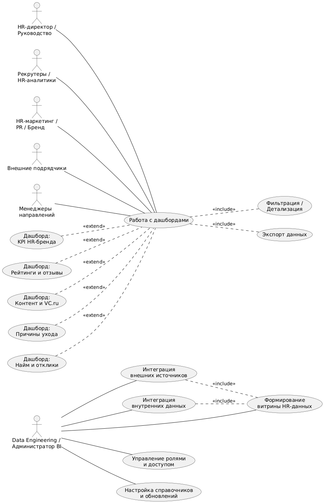

# Лабораторная работа №1
**Тема:** Формулирование требований к программной системе  
**Цель работы:** Научиться анализировать поставленную задачу, формулировать функциональные и нефункциональные требования к проектируемой системе.

## Результаты

### Перечень заинтересованных лиц (стейкхолдеров)

1.  **HR-директор ООО «Яндекс Крауд»**
    Отвечает за стратегию HR-бренда, набор персонала, удержание сотрудников и качество HR-коммуникаций. Заинтересован в получении агрегированной аналитики для принятия управленческих решений и мониторинга ключевых метрик.

2.  **HR-маркетинг / бренд-команда**
    Создаёт контент, публикации и коммуникационные кампании для повышения узнаваемости работодателя. Ежедневно используют данные системы для анализа эффективности публикаций, роста знания бренда и контроля SOV (share of voice).

3.  **Рекрутеры и тимлиды массового подбора**
    Работают с откликами, стоимостью отклика, бюджетами на привлечение, динамикой по городам и сегментам. Им важно видеть данные о рынке, конкурентоспособности вакансий и влиянии HR-бренда на конверсию в найм.

4.  **HR-аналитики**
    Разрабатывают витрины данных, валидируют показатели, формируют модель данных и обеспечивают корректность расчётов. Являются основными пользователями BI-системы на уровне глубокой аналитики.

5.  **Команда Data Engineering / Data Platform (в т.ч. DataLens)**
    Отвечают за интеграцию источников данных, построение пайплайнов, обновления витрин и техническую инфраструктуру. Интерес — стабильная и масштабируемая система, пригодная к дальнейшему развитию.

6.  **Менеджеры направлений и операционные руководители**
    Используют дашборды для мониторинга причин ухода сотрудников, анализа проблемных точек, управления командами и планирования HR-мероприятий.

7.  **Подразделение по работе с внешними партнёрами (Ancor)**
    Поставляют данные по найму и причинам ухода. Заинтересованы в прозрачном сравнении своей эффективности с внутренними метриками компании.

8.  **PR-команда и коммуникации Яндекса**
    Наблюдают за медиа-присутствием, динамикой упоминаний и влиянием HR-коммуникаций на SEO, SOV и брендовые показатели.

9.  **Аналитическая команда корпоративного уровня (центральный Яндекс)**
    Заинтересована в стандартизации аналитических решений, нормализации данных и повышении качества HR-аналитики в группе компаний.

10. **Сотрудники компании (косвенные стейкхолдеры)**
    Тональность отзывов и причины ухода — это данные, формирующие HR-бренд. Система влияет на оценку условий работы и внутреннюю обратную связь.

11. **Кандидаты на рынке труда (косвенные стейкхолдеры)**
    Восприятие бренда работодателя, отзывы и рейтинги используются как входные данные системы и влияют на основные KPI.

12. **Руководство ООО «Яндекс» (владельцы продукта/бизнеса)**
    Интересуются общими результатами найма, динамикой бренда и соблюдением планов по расширению команды.

### Перечень функциональных требований
*(ориентированы на потребности стейкхолдеров)*

#### 1. Интеграция внешних источников данных
1.1. Система должна автоматически загружать данные о рейтингах и отзывах работодателя с площадок Dreamjob, Otzovik, IRecommend, Avito.  
1.2. Система должна загружать статистику по публикациям и контенту с VC.ru (просмотры, открытия, реакции, комментарии, репосты, сохранения).  
1.3. Система должна поддерживать подключение дополнительных внешних источников (новые сайты отзывов, соцсети) с минимальными доработками.

#### 2. Интеграция внутренних источников данных
2.1. Система должна получать данные из CRM рекрутмента: отклики, вакансии, статус найма, этапы воронки.  
2.2. Система должна получать данные из внутренних HR-систем о сотрудниках и их увольнениях, включая причины ухода.  
2.3. Система должна поддерживать импорт данных от внешних подрядчиков (Ancor) по унифицированному формату.

#### 3. Формирование витрины HR-данных
3.1. Система должна консолидировать данные из всех подключенных источников в единую витрину HR-бренда.  
3.2. Система должна обеспечивать хранение истории изменений показателей минимум по месяцам за несколько лет.  
3.3. Система должна приводить разнородные метрики к единым справочникам (города, компании, типы причин ухода, уровни опыта и т.п.).  
3.4. Система должна рассчитывать предопределённые агрегаты и KPI (средний рейтинг, доля позитивных/негативных отзывов, стоимость отклика и т.д.).

#### 4. Дашборд «Рейтинги и отзывы работодателя» (HR-директор, HR-маркетинг, PR)
4.1. Система должна отображать динамику рейтингов по каждой площадке (общий рейтинг и частные показатели: условия труда, доход, коллектив, рост и др.).  
4.2. Система должна показывать количество положительных и негативных отзывов за выбранный период.  
4.3. Система должна сравнивать текущий месяц с предыдущим.  
4.4. Система должна позволять фильтровать данные периоду, типу рейтинга и другим атрибутам.

#### 5. Дашборд «Эффективность контента и HR-коммуникаций» (HR-маркетинг, PR, бренд-команда)
5.1. Система должна отображать статистику постов на VC.ru и других медиа: просмотры, открытия, реакции, комментарии, репосты, сохранения.  
5.2. Система должна позволять сравнивать эффективность отдельных постов между собой.

#### 6. Дашборд «Причины ухода сотрудников» (HR-директор, операционные руководители)
6.1. Система должна отображать структуру причин ухода сотрудников по месяцам (например: зарплата, карьерный рост, прочее).  
6.2. Система должна позволять сравнивать причины ухода в Яндекс Крауд и у внешнего подрядчика (Ancor).  
6.3. Система должна поддерживать фильтры по локациям, подразделениям и другим параметрам, если они доступны в исходных данных.

#### 7. Дашборд «Эффективность найма и откликов» (рекрутеры, HR-аналитики, HR-директор)
7.1. Система должна отображать по городам количество откликов, стоимость отклика и долю рынка.  
7.2. Система должна показывать разрез по уровню опыта кандидатов (без опыта, 1–3 года и т.д.).  
7.3. Система должна отражать данные по бюджетам и, при наличии, средние значения NET-зарплат по городам.  
7.4. Система должна поддерживать отдельные витрины и отчёты по Москве и другим стратегическим регионам.

#### 8. KPI-панель HR-бренда (топ-менеджмент, HR-директор)
8.1. Система должна отображать целевые и фактические значения ключевых показателей: рейтинги по основным площадкам.  
8.2. Система должна визуально выделять отклонения за текущий и предыдущий месяцы.  
8.3. Система должна поддерживать быстрый переход к детализации в соответствующие дашборды.

#### 9. Фильтрация, детализация и экспорт
9.1. Система должна поддерживать фильтрацию по периоду, городу, уровню опыта, источнику данных и другим бизнес-измерениям.  
9.2. Система должна предоставлять возможность drill-down: от сводных показателей к деталям (до уровня отдельного поста, города).

#### 10. Управление доступом и ролями
10.1. Система должна поддерживать разграничение прав доступа к дашбордам и данным в зависимости от роли пользователя (просмотр, редактирование, администрирование).  
10.2. Система должна обеспечивать отдельные представления для внешних подрядчиков (ограниченный набор показателей без конфиденциальных данных сотрудников).

#### 11. Администрирование и конфигурация системы (Data Engineering, администратор BI)
11.1. Система должна предоставлять интерфейс или конфигурационные механизмы для управления расписанием обновления данных.  
11.2. Система должна позволять добавлять и изменять справочники информации.

### Диаграмма вариантов использования

### Перечень сделанных предположений

1.  **Предполагается, что объём данных будет расти постепенно**, без кратных скачков, т.е. система не будет сталкиваться с пиковыми нагрузками, свойственными высокотрафиковым сервисам.
    *   *Влияние:* требования к производительности можно определить на уровне BI-систем среднего масштаба.

2.  **Внешние источники данных предоставляют API или структурированные выгрузки**, которые можно автоматически интегрировать без парсинга HTML.
    *   *Влияние:* влияет на требования к надёжности и стабильности механизмов загрузки.

3.  **Пользователи системы преимущественно работают в офисной сети или через корпоративный VPN**, а не с нестабильных мобильных устройств.
    *   *Влияние:* снижает требования к адаптивности интерфейса и доступности при плохом соединении.

4.  **В компании существует принятая политика сохранения конфиденциальности HR-данных**, и система должна ей соответствовать.
    *   *Влияние:* определяет усиленные требования к безопасности и разграничению прав.

5.  **Система будет использовать существующую BI-платформу (Yandex DataLens)**, а не собственную разработку визуализации.
    *   *Влияние:* часть нефункциональных требований (масштабируемость, отказоустойчивость, производительность визуализаций) делегируется платформе.

6.  **Число одновременных пользователей системы невелико** (до 10–15 активных пользователей).
    *   *Влияние:* требования к нагрузке остаются умеренными.

7.  **Процессы загрузки данных работают по расписанию (ежедневно), а не в строгом real-time режиме**, но бизнес ожидает near real-time актуальность по ключевым метрикам.
    *   *Влияние:* влияет на требования к актуальности и стабильности загрузок.

### Перечень нефункциональных требований (3–5 приоритетных)

#### 1. Производительность и время отклика
*   **Требование:**
    Система должна обеспечивать загрузку дашбордов и визуализаций не более чем за 5-10 секунд при стандартных фильтрах и не более 15 секунд при максимальной детализации.
*   **Обоснование:**
    Пользователи активно взаимодействуют с визуальными панелями, применяют фильтры и drill-down. Длительные ожидания затрудняют аналитику и принятие решений.

#### 2. Актуальность данных (Near Real-Time)
*   **Требование:**
    Данные в системе должны обновляться не реже одного раза в сутки для внешних источников (отзывы, VC.ru) и для данных найма.
    Система должна гарантировать, что задержка данных не превышает 24 часов для всех источников.
*   **Обоснование:**
    HR-бренд и отзывы могут меняться динамично; важно быстро заметить резкий рост негатива или падение откликов.

#### 3. Надёжность и устойчивость загрузок данных
*   **Требование:**
    Система должна обеспечивать:
    *   автоматическое повторение попытки загрузки при сбое (пока не загрузится страница);
    *   журналирование всех загрузок;
    *   процент успешных загрузок не ниже 99%.
*   **Обоснование:**
    BI-дашборды бесполезны, если данные в них неполные или устаревшие. Стабильность — ключевой фактор.

#### 4. Безопасность и разграничение прав доступа
*   **Требование:**
    Система должна поддерживать ролевую модель, гарантирующую:
    *   доступ к обезличенным агрегированным данным для внешних подрядчиков;
    *   доступ к расширенной информации для HR-аналитиков;
    *   доступ к KPI и управленческим панелям для руководства;
    *   защиту персональных данных сотрудников в соответствии с внутренними политиками Яндекса.
*   **Обоснование:**
    В HR-данных содержится чувствительная информация, и некорректный доступ может привести к утечкам конфиденциальных данных.

#### 5. Масштабируемость и расширяемость
*   **Требование:**
    Система должна поддерживать добавление:
    *   новых источников данных,
    *   новых страниц отзывов,
    *   новых метрик и KPI,
    *   новых дашбордов без серьёзных изменений архитектуры и существующей витрины данных.
*   **Обоснование:**
    HR-бренд и его метрики постоянно расширяются; система должна адаптироваться без полной пересборки.
