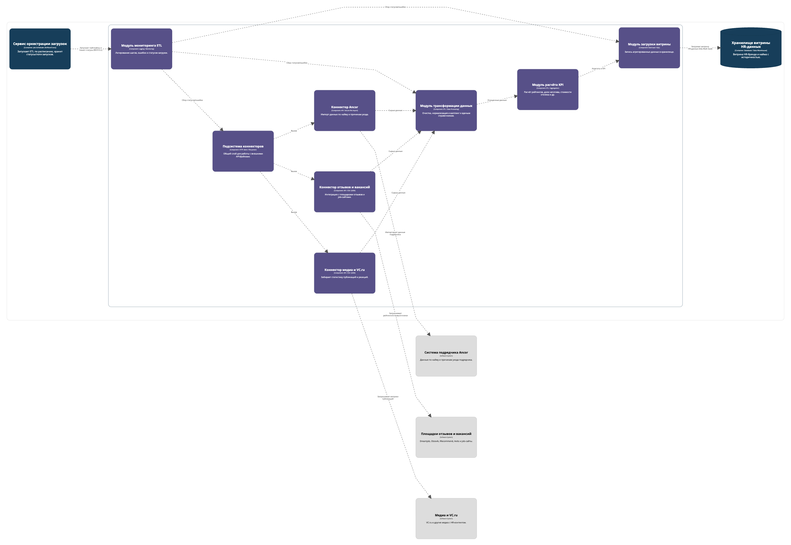
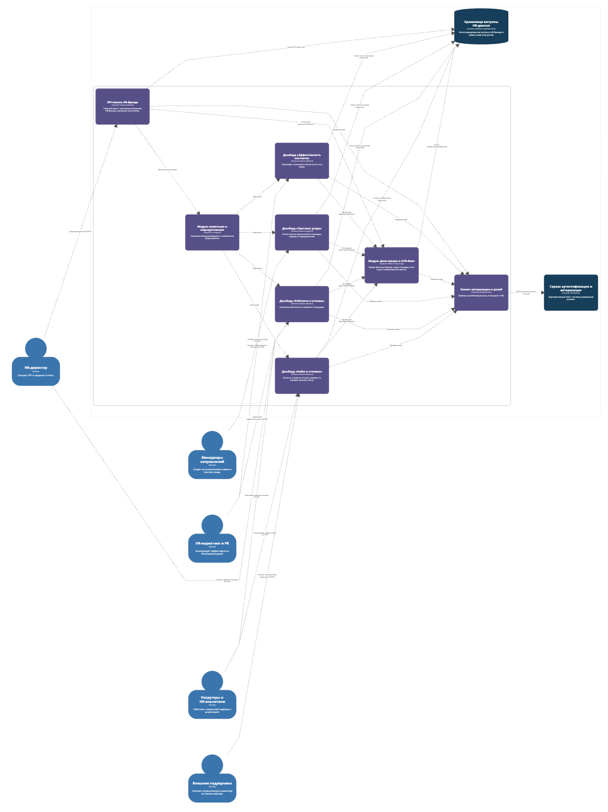

# Лабораторная работа №2
**Тема:** Использование нотации C4 model для проектирования архитектуры программной системы  
**Цель работы:** Получить опыт использования графической нотации для фиксации архитектурных решений.

## Результаты

### Диаграмма системного контекста

#### Основные акторы (пользователи системы)

1.  **HR-директор**
    Использует систему для анализа стратегических показателей HR-бренда, мониторинга динамики рейтингов и принятия управленческих решений.

2.  **HR-маркетинг и PR**
    Анализируют эффективность публикаций, охватов, реакций и динамику репутационных метрик, чтобы корректировать HR-коммуникации.

3.  **Рекрутеры и HR-аналитики**
    Работают с дашбордами найма, стоимостью отклика, конверсией воронки, оценкой рынка и анализом динамики откликов.

4.  **Менеджеры направлений**
    Используют отчёты по причинам ухода сотрудников и данным найма для оперативного управления командами.

5.  **Внешние подрядчики**
    Получают доступ к ограничённым данным, чтобы сопоставлять собственную эффективность с результатами компании.

#### Главная система: BI-система мониторинга HR-бренда (ядро архитектуры)
Единая аналитическая платформа на базе Yandex DataLens, которая:
*   объединяет внутренние и внешние источники данных;
*   формирует витрину HR-бренда;
*   рассчитывает ключевые метрики и KPI;
*   предоставляет дашборды для пользователей разных ролей.

Система является центральным объектом диаграммы, вокруг которого строятся все взаимодействия.

#### Внешние информационные системы

1.  **Площадки отзывов и вакансий**
    *Примеры:* Dreamjob, Otzovik, IRecommend, Avito, сайты вакансий.
    *Предоставляемые данные:*
    *   рейтинги работодателя,
    *   отзывы сотрудников и кандидатов,
    *   показатели активности на вакансиях.

2.  **Медиа и VC.ru**
    *Предоставляемые данные:*
    *   статистика по публикациям: просмотры, реакции, вовлечённость, комментарии, репосты.
    *Использование:* анализ эффективности HR-контента.

3.  **Система подрядчика Ancor**
    *Предоставляемые данные:*
    *   данные по найму,
    *   причины увольнений сотрудников у подрядчика.
    *Возможность:* сравнивать внешние и внутренние показатели.

### Диаграмма контейнеров

#### Базовый архитектурный стиль
Для BI-системы выбран комбинированный подход:
*   **Логически** — это слоистая (layered) архитектура:
    *   слой интеграции данных (Сервис интеграции данных, Сервис оркестрации);
    *   слой хранения и обработки (Хранилище витрины HR-данных);
    *   слой представления и аналитики (BI-интерфейс и дашборды);
    *   инфраструктурный слой (Сервис аутентификации и авторизации);
*   **Физически** слои реализованы в виде нескольких сервисов/контейнеров, которые могут развёртываться и масштабироваться независимо.

Такой стиль хорошо соответствует BI-системе Yandex DataLens: загрузка и подготовка данных отделена от пользовательской аналитики, а вопросы доступа и безопасности вынесены в отдельный контейнер.

#### Топология и модули развертывания
Требование задания — «несколько модулей развертывания и наличие сетевого взаимодействия» — выполняется за счёт следующей топологии:

1.  **Сервис интеграции данных (ingestion)**
    Отдельный backend-сервис (например, Python + Airflow workers), который по сети обращается к внешним API (площадки отзывов, VC.ru, Ancor) и к внутреннему хранилищу. Развёртывается как отдельный модуль, может масштабироваться по нагрузке на загрузку данных.

2.  **Сервис оркестрации загрузок (scheduler)**
    Управляет расписанием ETL-процессов и по сети дергает endpoint’ы сервиса интеграции. Это отдельный модуль (например, Airflow Scheduler, cron-сервис или Kubernetes CronJob), который не зависит от BI-интерфейса.

3.  **Хранилище витрины HR-данных (storage)**
    База данных / DWH (например, Yandex DB), развёрнутая как отдельный сервер/кластер. К нему по сети обращаются:
    *   сервис интеграции (на запись),
    *   BI-интерфейс (на чтение).

4.  **BI-интерфейс и дашборды (ui)**
    Web-приложение/BI-инструмент (Yandex DataLens), развёрнутое как отдельный сервис. Пользователи подключаются к нему по HTTPS; сам интерфейс по сети взаимодействует с хранилищем данных и сервисом авторизации.

5.  **Сервис аутентификации и авторизации (auth)**
    Отдельный модуль, интегрированный с корпоративным SSO. BI-интерфейс вызывает его по сети при входе пользователя и проверке ролей.

6.  **Внешние системы (reviewAndJobs, media, ancorSys)**
    На уровне контейнерной диаграммы выступают как отдельные удалённые сервисы, с которыми сервис интеграции взаимодействует по HTTP/API или через файловые выгрузки.

**Итог по топологии:**
*   система состоит из нескольких отдельно развёртываемых модулей (ingestion, scheduler, storage, ui, auth);
*   между ними есть сетевое взаимодействие (HTTP, SQL, SSO);
*   архитектура остаётся достаточно простой, но при этом реалистичной для корпоративной BI-системы.

### Диаграмма компонентов для одного контейнера

#### Краткое описание основных элементов диаграммы компонентов
Эта диаграмма раскрывает внутреннее устройство сервиса интеграции данных, который отвечает за сбор, обработку и загрузку HR-данных в витрину.

1.  **Подсистема коннекторов (extConnectors)**
    *   Общий технический слой работы с внешними источниками.
    *   Инкапсулирует HTTP-запросы, работу с файлами, авторизацию.
    *   Помогает не дублировать сетевую и транспортную логику в каждом коннекторе.

2.  **Коннектор отзывов и вакансий (reviewConnector)**
    *   Интеграция с площадками отзывов и job-сайтами (Dreamjob, Otzovik, IRecommend, Avito и др.).
    *   Забирает рейтинги работодателя, тексты отзывов, данные по откликам и вакансиям.
    *   Отдаёт данные дальше на трансформацию.

3.  **Коннектор медиа и VC.ru (mediaConnector)**
    *   Работает с VC.ru и другими медиа.
    *   Получает статистику по публикациям: просмотры, реакции, комментарии, репосты и пр.
    *   Отдаёт сырые данные в модуль трансформации.

4.  **Коннектор Ancor (ancorConnector)**
    *   Интеграция с внешним подрядчиком по рекрутингу.
    *   Импортирует данные о найме и причинах ухода сотрудников у подрядчика.
    *   Учитывает повышенные требования к безопасности обмена (secure import).

5.  **Модуль трансформации данных (transformEngine)**
    *   Очищает данные (дубликаты, некорректные значения).
    *   Нормализует структуры из разных источников.
    *   Маппит значения к единым справочникам (города, причины ухода, уровни опыта).
    *   Готовит данные к бизнес-агрегации и расчёту KPI.

6.  **Модуль расчёта KPI (kpiCalc)**
    *   Рассчитывает бизнес-метрики:
        *   средний рейтинг по площадкам,
        *   долю негативных/позитивных отзывов,
        *   стоимость отклика,
        *   показатели найма и откликов по городам и т.д.
    *   Передаёт готовые агрегаты в загрузчик витрины.

7.  **Модуль загрузки витрины (dwhLoader)**
    *   Отвечает за запись данных в хранилище витрины HR-данных.
    *   Выполняет batch-загрузки (bulk load / SQL).
    *   Обеспечивает корректность загрузок.

8.  **Модуль мониторинга ETL (etlMonitor)**
    *   Собирает статусы исполнения шагов ETL-пайплайнов.
    *   Логирует ошибки, время выполнения, объёмы загруженных данных.
    *   Даёт возможность оперативно контролировать качество и стабильность загрузок.

### Диаграмма компонентов для остальных контейнеров

#### Краткое описание основных элементов диаграммы
Диаграмма показывает, как устроен фронтовой/аналитический слой: какие логические компоненты есть внутри BI-интерфейса и как они используют данные.

1.  **KPI-панель HR-бренда (kpiDashboard)**
    *   Сводный экран для HR-директора и топ-менеджмента.
    *   Отображает ключевые KPI HR-бренда (рейтинги, доля негатива, динамика откликов и т.д.), целевые и фактические значения, «сигналы» отклонений.
    *   Является точкой входа для перехода к детализации (через модуль навигации).

2.  **Дашборд «Рейтинги и отзывы» (ratingsDashboard)**
    *   Анализ рейтингов и отзывов по площадкам (Dreamjob, Otzovik, IRecommend, Avito и др.).
    *   Показывает динамику общего и частных рейтингов (условия труда, доход, коллектив, рост и т.п.), количество позитивных/негативных отзывов по периодам, сравнение площадок и трендов.

3.  **Дашборд «Эффективность контента» (contentDashboard)**
    *   Для HR-маркетинга и PR.
    *   Отображает метрики постов и статей: просмотры, открытия, реакции, комментарии, репосты, сохранения, эффективность кампаний и отдельных публикаций.

4.  **Дашборд «Причины ухода» (attritionDashboard)**
    *   Фокус на удержании и проблемных зонах.
    *   Показывает структуру причин увольнений (зарплата, рост, условия и пр.), динамику по периодам, разрезы по городам, подразделениям, сегментам сотрудников.

5.  **Дашборд «Найм и отклики» (hiringDashboard)**
    *   Для рекрутеров и HR-аналитиков.
    *   Показывает количество откликов по городам и каналам, стоимость отклика, разрезы по уровню опыта кандидатов, связь бюджетов и притока откликов.

6.  **Модуль фильтрации и drill-down (filterModule)**
    *   Общий компонент для всех дашбордов.
    *   Реализует фильтрацию по периоду, городу, уровню опыта и др., а также механизмы drill-down: от агрегированных KPI к деталям (город, кампания).
    *   Работает с витриной данных и таблицами измерений (справочниками).

7.  **Модуль навигации и маршрутизации (navModule)**
    *   Отвечает за переходы между дашбордами (например, из KPI-панели в «Рейтинги» или «Найм»), сохранённые представления (наборы фильтров для разных ролей).
    *   Обеспечивает единый пользовательский сценарий — чтобы система воспринималась как цельное приложение, а не набор разрозненных отчётов.

8.  **Клиент авторизации и ролей (authClient)**
    *   Интеграция с внешним SSO/сервисом авторизации.
    *   Определяет, какие дашборды и какие разрезы данных доступны данному пользователю (ограниченный доступ для подрядчиков, полный — для HR-директора).
    *   Передаёт информацию о ролях в компоненты дашбордов для управления видимостью элементов интерфейса и данных.

9.  **Хранилище витрины HR-данных (dwh как Software System)**
    *   Логическое хранилище, куда пишет ETL и откуда читают дашборды.
    *   На этой диаграмме выступает как внешний по отношению к UI компонент: все дашборды и модуль фильтров делают к нему read-only запросы.
