# Лабораторная работа №6
**Тема:** Использование шаблонов проектирования
**Цель работы:** Получить опыт применения шаблонов проектирования при написании кода программной системы.

## Результаты

### Порождающие шаблоны

#### 1. Singleton (Одиночка)
**Назначение:** Этот шаблон используется для того, чтобы создать только один экземпляр какого-либо класса, например, класса для подключения к базе данных.

**Применение в проекте:**
Будем использовать Singleton для подключения к базе данных, чтобы не создавать несколько соединений.

**Реализация:**
```python
class DBConnection:
    _instance = None

    def __new__(cls, *args, **kwargs):
        if not cls._instance:
            cls._instance = super(DBConnection, cls).__new__(cls)
            cls._instance.connection = psycopg.connect(os.getenv("DATABASE_URL"))
        return cls._instance

    def get_connection(self):
        return self.connection
```

#### UML-диаграмма
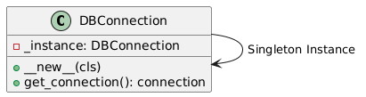

**Пояснение:**
С помощью этого шаблона мы гарантируем, что в приложении будет использоваться только один экземпляр класса DBConnection, обеспечивая тем самым управление соединением с базой данных.

#### 2. Factory Method (Фабричный метод)
**Назначение:** Фабричный метод позволяет создавать объекты без привязки к конкретному классу. Это полезно, например, для создания источников данных.

**Применение в проекте:**
Мы можем создать фабричный метод для создания источников данных, который будет вызывать различные методы в зависимости от типа источника (например, API, CSV, CRM и т.д.).

**Реализация:**
```python
class SourceFactory:
    @staticmethod
    def create_source(source_type: str, source_id: str, connection_params: dict) -> SourceCreateRequest:
        if source_type == "review_site":
            return SourceCreateRequest(source_id=source_id, type="review_site", connection_params=connection_params)
        elif source_type == "media":
            return SourceCreateRequest(source_id=source_id, type="media", connection_params=connection_params)
        elif source_type == "crm":
            return SourceCreateRequest(source_id=source_id, type="crm", connection_params=connection_params)
        else:
            raise ValueError(f"Unknown source type: {source_type}")
```

#### UML-диаграмма
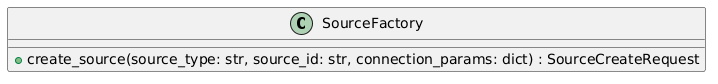

**Пояснение:**
В методе `create_source` реализована логика, которая создаёт объект нужного типа, не указывая напрямую класс.

#### 3. Abstract Factory (Абстрактная фабрика)
**Назначение:** Абстрактная фабрика предоставляет интерфейсы для создания семейства связанных объектов.

**Применение в проекте:**
Создадим абстрактную фабрику для создания разных типов источников данных (например, API источники и источники данных через CSV).

**Реализация:**
```python
class SourceAbstractFactory(ABC):
    @abstractmethod
    def create_source(self, source_id: str, connection_params: dict) -> SourceCreateRequest:
        pass

class ReviewSiteSourceFactory(SourceAbstractFactory):
    def create_source(self, source_id: str, connection_params: dict) -> SourceCreateRequest:
        return SourceCreateRequest(source_id=source_id, type="review_site", connection_params=connection_params)

class MediaSourceFactory(SourceAbstractFactory):
    def create_source(self, source_id: str, connection_params: dict) -> SourceCreateRequest:
        return SourceCreateRequest(source_id=source_id, type="media", connection_params=connection_params)
```

#### UML-диаграмма
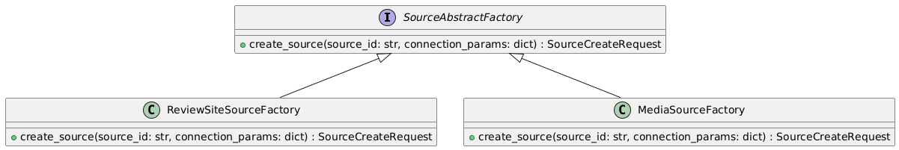

**Пояснение:**
*   Абстрактная фабрика `SourceAbstractFactory` определяет интерфейс для создания источников данных.
*   Реализованы две фабрики `ReviewSiteSourceFactory` и `MediaSourceFactory`, которые создают соответствующие источники.

**Заключение по порождающим шаблонам:**
*   **Singleton** помогает гарантировать, что у нас будет только один экземпляр для подключения к базе данных.
*   **Factory Method** упрощает создание объектов без привязки к конкретному классу, что особенно полезно для работы с источниками данных.
*   **Abstract Factory** помогает организовать создание семейства связанных объектов, например, различных типов источников данных.

### Структурные шаблоны

#### 1. Adapter (Адаптер)
**Назначение:**
Шаблон Adapter используется для преобразования интерфейсов классов в требуемый интерфейс. Он помогает интегрировать различные системы, которые могут быть несовместимы по интерфейсу.

**Применение в проекте:**
В нашем проекте можно применить этот шаблон для преобразования разных форматов данных, поступающих от различных источников данных (например, API, CSV, JSON), в единый формат, который будет использоваться в нашей BI-системе для дальнейшей обработки.

**Реализация:**
```python
class DataAdapter:
    def __init__(self, source_data: dict):
        self.source_data = source_data

    def get_data(self):
        # Преобразуем данные из формата source_data в необходимый формат
        return {
            "source_id": self.source_data["source_id"],
            "type": self.source_data["type"],
            "status": self.source_data["status"]
        }

# Пример использования
source_data = {"source_id": "dreamjob", "type": "review_site", "status": "active"}
adapter = DataAdapter(source_data)
formatted_data = adapter.get_data()
```

#### UML-диаграмма
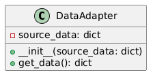

**Пояснение:**
*   Adapter преобразует данные в единую форму, которая затем будет использована в других компонентах системы.

#### 2. Bridge (Мост)
**Назначение:**
Шаблон Bridge разделяет абстракцию и реализацию, позволяя их изменять независимо. Это полезно для ситуаций, где есть несколько различных реализаций, но нужно обеспечить их взаимодействие через абстракцию.

**Применение в проекте:**
В нашем проекте можно использовать Bridge для разделения абстракции взаимодействия с источниками данных (например, REST API, CSV) и реализации обработки данных. Это позволяет добавлять новые реализации без изменений в основном коде.

**Реализация:**
```python
class SourceDataBridge:
    def fetch_data(self):
        raise NotImplementedError()

class RestAPIData(SourceDataBridge):
    def fetch_data(self):
        # Логика получения данных из REST API
        return {"data": "some data from API"}

class CsvData(SourceDataBridge):
    def fetch_data(self):
        # Логика получения данных из CSV файла
        return {"data": "some data from CSV"}

# Пример использования
source = RestAPIData()
data = source.fetch_data()
```

#### UML-диаграмма
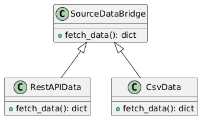

**Пояснение:**
*   Bridge позволяет создавать абстракции для взаимодействия с разными источниками данных и изменять реализацию этих источников независимо.

#### 3. Composite (Композит)
**Назначение:**
Шаблон Composite используется для объединения объектов в древовидные структуры для представления частей и целого. Это позволяет клиенту работать с индивидуальными объектами и их композициями одинаково.

**Применение в проекте:**
Для нашей системы можно применить Composite для моделирования структуры пайплайнов, состоящих из разных этапов (например, извлечение данных, трансформация и загрузка). Мы можем комбинировать различные этапы в единую задачу ETL.

**Реализация:**
```python
class PipelineComponent:
    def process(self):
        raise NotImplementedError()

class ExtractData(PipelineComponent):
    def process(self):
        return "Data extracted"

class TransformData(PipelineComponent):
    def process(self):
        return "Data transformed"

class LoadData(PipelineComponent):
    def process(self):
        return "Data loaded"

class ETLComposite(PipelineComponent):
    def __init__(self):
        self.components = []

    def add_component(self, component: PipelineComponent):
        self.components.append(component)

    def process(self):
        results = [component.process() for component in self.components]
        return " -> ".join(results)

# Пример использования
etl_pipeline = ETLComposite()
etl_pipeline.add_component(ExtractData())
etl_pipeline.add_component(TransformData())
etl_pipeline.add_component(LoadData())

print(etl_pipeline.process())  # "Data extracted -> Data transformed -> Data loaded"
```

#### UML-диаграмма
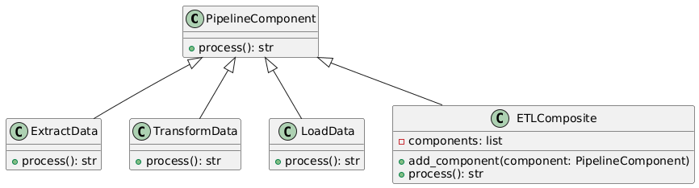

**Пояснение:**
*   Composite позволяет создавать структуру для выполнения последовательных шагов в ETL-процессах.

#### 4. Decorator (Декоратор)
**Назначение:**
Шаблон Decorator позволяет динамически добавлять новые функции объектам, не изменяя их структуру. Это полезно, когда нужно расширить функциональность объектов без изменения их базового кода.

**Применение в проекте:**
Для нашего проекта можно использовать Decorator для расширения функциональности обработки данных. Например, добавление логирования или кэширования к этапам ETL.

**Реализация:**
```python
class DataProcessor:
    def process(self):
        return "Processing data"

class DataDecorator(DataProcessor):
    def __init__(self, wrapped_processor: DataProcessor):
        self.wrapped_processor = wrapped_processor

    def process(self):
        return f"Logging: {self.wrapped_processor.process()}"

# Пример использования
processor = DataProcessor()
decorated_processor = DataDecorator(processor)
print(decorated_processor.process())  # "Logging: Processing data"
```

#### UML-диаграмма
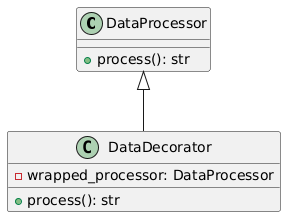

**Пояснение:**
*   Decorator позволяет нам динамически добавлять дополнительные функции (например, логирование) к обработке данных без изменения основной логики.

**Заключение по структурным шаблонам:**
1.  **Adapter** — помогает преобразовывать несовместимые интерфейсы.
2.  **Bridge** — разделяет абстракцию и реализацию, позволяя их изменять независимо.
3.  **Composite** — позволяет работать с объектами и их композициями как с единым целым.
4.  **Decorator** — расширяет функциональность объектов без изменения их базового кода.

### Поведенческие шаблоны

#### 1. Chain of Responsibility (Цепочка обязанностей)
**Назначение:**
Шаблон Chain of Responsibility позволяет передавать запрос по цепочке обработчиков. Каждый обработчик решает, может ли он обработать запрос, или передает его дальше по цепочке.

**Применение в проекте:**
В нашем проекте можно применить Chain of Responsibility для обработки различных шагов в процессе ETL. Например, каждый этап (извлечение, трансформация, загрузка) может быть обработан отдельным компонентом, который решает, может ли он обработать данные или передаст их следующему этапу.

**Реализация:**
```python
class ETLStep:
    def __init__(self, next_step: ETLStep = None):
        self.next_step = next_step

    def process(self, data):
        if self.next_step:
            return self.next_step.process(data)
        return data

class ExtractData(ETLStep):
    def process(self, data):
        print("Extracting data...")
        data["extracted"] = True
        return super().process(data)

class TransformData(ETLStep):
    def process(self, data):
        print("Transforming data...")
        data["transformed"] = True
        return super().process(data)

class LoadData(ETLStep):
    def process(self, data):
        print("Loading data...")
        data["loaded"] = True
        return super().process(data)

# Пример использования
etl_chain = ExtractData(TransformData(LoadData()))
data = {}
etl_chain.process(data)
print(data)  # {"extracted": True, "transformed": True, "loaded": True}
```

#### UML-диаграмма
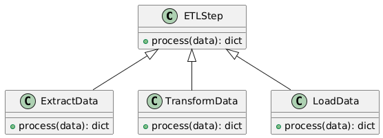

**Пояснение:**
*   Chain of Responsibility помогает обрабатывать запросы (в нашем случае — этапы ETL) последовательно, позволяя гибко добавлять новые этапы или менять порядок их обработки.

#### 2. Command (Команда)
**Назначение:**
Шаблон Command инкапсулирует запрос в объект, позволяя параметризовать объекты с параметрами, очередями и запросами. Это позволяет легко добавлять новые команды без изменения клиентского кода.

**Применение в проекте:**
Для проекта, где нужно запускать и управлять процессами ETL, можно использовать шаблон Command для инкапсуляции команд на запуск различных процессов (например, запуск ETL-пайплайна или отчета).

**Реализация:**
```python
class Command:
    def execute(self):
        raise NotImplementedError()

class StartETLPipelineCommand(Command):
    def __init__(self, pipeline_id: str):
        self.pipeline_id = pipeline_id

    def execute(self):
        print(f"Starting ETL pipeline {self.pipeline_id}")

class StopETLPipelineCommand(Command):
    def __init__(self, pipeline_id: str):
        self.pipeline_id = pipeline_id

    def execute(self):
        print(f"Stopping ETL pipeline {self.pipeline_id}")

# Пример использования
start_command = StartETLPipelineCommand("reviews_etl")
stop_command = StopETLPipelineCommand("reviews_etl")

start_command.execute()
stop_command.execute()
```

#### UML-диаграмма
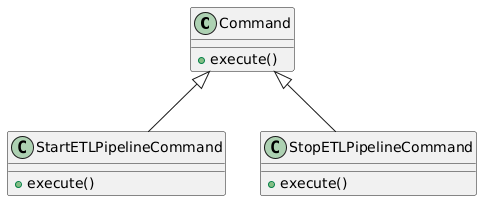

**Пояснение:**
*   Command инкапсулирует запросы на выполнение операций, давая возможность расширять функциональность без изменения текущего кода.

#### 3. Observer (Наблюдатель)
**Назначение:**
Шаблон Observer используется для создания механизма подписки, при котором объект-издатель уведомляет подписчиков о произошедших изменениях. Подписчики могут обновляться автоматически, когда это необходимо.

**Применение в проекте:**
Для проекта можно использовать Observer для мониторинга состояний ETL-процессов и уведомления заинтересованных участников о статусе выполнения.

**Реализация:**
```python
class Observer:
    def update(self, message: str):
        raise NotImplementedError()

class PipelineStatusObserver(Observer):
    def update(self, message: str):
        print(f"Pipeline Status Update: {message}")

class ETLProcess:
    def __init__(self):
        self._observers = []

    def add_observer(self, observer: Observer):
        self._observers.append(observer)

    def remove_observer(self, observer: Observer):
        self._observers.remove(observer)

    def notify(self, message: str):
        for observer in self._observers:
            observer.update(message)

# Пример использования
etl_process = ETLProcess()
status_observer = PipelineStatusObserver()

etl_process.add_observer(status_observer)
etl_process.notify("Pipeline 'reviews_etl' is running.")
```

#### UML-диаграмма
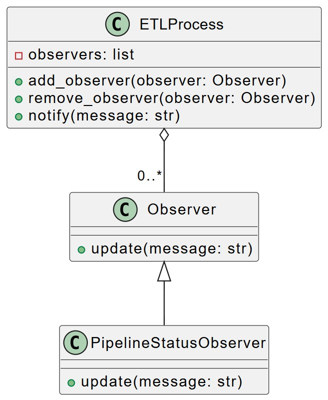

**Пояснение:**
*   Observer позволяет уведомлять заинтересованные компоненты о статусах выполнения ETL-процессов, повышая информативность системы.

#### 4. Strategy (Стратегия)
**Назначение:**
Шаблон Strategy позволяет менять алгоритмы выполнения операций на лету, что помогает выбирать наилучшую стратегию выполнения задачи в зависимости от ситуации.

**Применение в проекте:**
Для нашего ETL-процесса можно использовать Strategy для выбора алгоритмов обработки данных, например, разных стратегий трансформации данных в зависимости от источника.

**Реализация:**
```python
class TransformStrategy:
    def transform(self, data):
        raise NotImplementedError()

class SimpleTransformStrategy(TransformStrategy):
    def transform(self, data):
        return data

class ComplexTransformStrategy(TransformStrategy):
    def transform(self, data):
        return {key: value * 2 for key, value in data.items()}

class ETLProcess:
    def __init__(self, strategy: TransformStrategy):
        self.strategy = strategy

    def process_data(self, data):
        return self.strategy.transform(data)

# Пример использования
data = {"a": 1, "b": 2}
etl_process = ETLProcess(SimpleTransformStrategy())
print(etl_process.process_data(data))  # {'a': 1, 'b': 2}

etl_process = ETLProcess(ComplexTransformStrategy())
print(etl_process.process_data(data))  # {'a': 2, 'b': 4}
```

#### UML-диаграмма
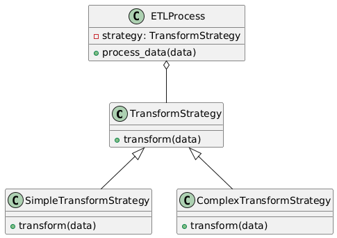

**Пояснение:**
*   Strategy позволяет динамически менять стратегию трансформации данных в зависимости от условий, обеспечивая гибкость и расширяемость системы.

#### 5. State (Состояние)
**Назначение:**
Шаблон State позволяет объектам менять свое поведение в зависимости от их состояния. Это полезно, когда поведение объекта зависит от его внутреннего состояния.

**Применение в проекте:**
Для ETL-процесса можно использовать State для изменения состояния пайплайна в зависимости от этапа (например, "извлечение", "трансформация", "загрузка").

**Реализация:**
```python
class State:
    def handle(self):
        raise NotImplementedError()

class ExtractState(State):
    def handle(self):
        print("Extracting data")

class TransformState(State):
    def handle(self):
        print("Transforming data")

class LoadState(State):
    def handle(self):
        print("Loading data")

class ETLProcess:
    def __init__(self):
        self.state = ExtractState()

    def set_state(self, state: State):
        self.state = state

    def execute(self):
        self.state.handle()

# Пример использования
etl_process = ETLProcess()
etl_process.execute()  # Extracting data
etl_process.set_state(TransformState())
etl_process.execute()  # Transforming data
etl_process.set_state(LoadState())
etl_process.execute()  # Loading data
```

#### UML-диаграмма
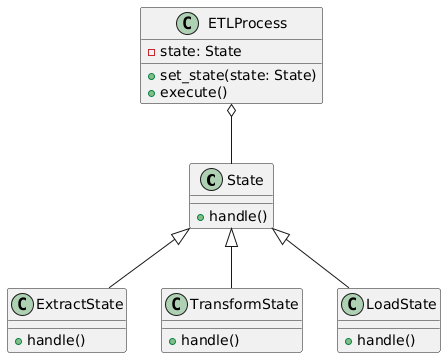

**Пояснение:**
*   State позволяет менять поведение объекта в зависимости от его текущего состояния, что важно для управления этапами ETL.

**Заключение по поведенческим шаблонам:**
1.  **Chain of Responsibility** — обрабатывает шаги ETL последовательно.
2.  **Command** — инкапсулирует команды для работы с процессами ETL.
3.  **Observer** — уведомляет подписчиков о статусе выполнения ETL.
4.  **Strategy** — позволяет менять стратегию трансформации данных.
5.  **State** — меняет поведение объекта в зависимости от его состояния.
