# Лабораторная работа №4
**Тема:** Проектирование REST API  
**Цель работы:** Получить практический опыт проектирования программного интерфейса (REST API) на примере сервиса интеграции данных BI-системы мониторинга HR-бренда и репутационных метрик работодателя.

## Выбранный сервис системы
**Сервис интеграции данных (ETL / Backend Service)**

Назначение сервиса — управление процессами загрузки, обработки и агрегации данных из внешних и внутренних источников (площадки отзывов, медиа, данные подрядчиков, внутренние HR-системы) с последующей записью в витрину HR-данных.

Сервис предоставляет API для:
*   управления источниками данных (sources);
*   управления конфигурациями ETL-пайплайнов (pipelines);
*   запуска загрузок (runs);
*   мониторинга статусов и получения логов выполнения.

## Принятые проектные решения при проектировании API
1.  **Ресурсная модель (REST)**
    *   Ресурсы: `sources`, `pipelines`, `runs`.
    *   URL описывают сущности, а не “действия”.
2.  **Версионирование API через URL**
    *   Все эндпоинты начинаются с `/api/v1/...`.
    *   Упрощает развитие API без поломки клиентов.
3.  **Стандартные HTTP-методы**
    *   `GET` — чтение, `POST` — создание/запуск, `PUT` — обновление, `DELETE` — удаление.
4.  **JSON как единый формат обмена**
    *   Запросы/ответы используют `application/json` (кроме `DELETE 204`, где тела нет).
5.  **Разделение “конфигурации” и “исполнения”**
    *   `pipelines` — конфигурация (источники, schedule, target).
    *   `runs` — экземпляры запусков с `run_id`, статусом и логами.
6.  **Идемпотентность операций управления**
    *   `PUT` и `DELETE` спроектированы как идемпотентные по смыслу (повторное применение обновления не “ломает” состояние; повторный `DELETE` вернёт `404`, так как ресурса больше нет).
7.  **Защита целостности данных при удалении источников**
    *   `DELETE /sources/{id}` запрещён, если источник используется в каком-либо pipeline (возвращается `400`).
8.  **Единый формат ошибок**
    *   Ошибки возвращаются через `HTTPException` FastAPI в виде:
    *   `{ "detail": "..." }`
    *   Это соответствует тестам (например, `409`, `400`, `404`).
9.  **Симуляция “асинхронности” запуска**
    *   `POST /pipelines/{id}/runs` возвращает `202 Accepted`.
    *   Запуск сразу помечается как `success`, чтобы можно было сразу проверять `GET /runs/{run_id}` и логи.

## Документация по API
**Базовые параметры**
*   **Base URL:** `http://127.0.0.1:8000/api/v1` (в Postman это `{{baseUrl}}/api/v1`)
*   **Формат данных:** `application/json`

---

### 1) Управление источниками данных (Sources)

#### GET /sources
**Описание:** получить список источников.

**Ответ 200 (пример):**
```json
[
  {
    "source_id": "dreamjob",
    "type": "review_site",
    "status": "active"
  }
]
```

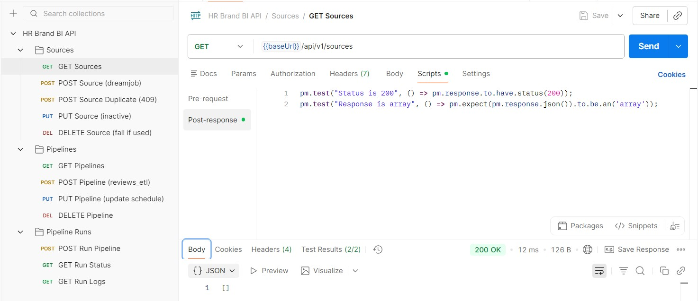

#### POST /sources
**Описание:** добавить источник данных.

**Тело запроса:**
```json
{
  "source_id": "dreamjob",
  "type": "review_site",
  "connection_params": {},
  "status": "active"
}
```

**Ответ 201:**
```json
[
  {
    "source_id": "dreamjob",
    "type": "review_site",
    "status": "active"
  }
]
```

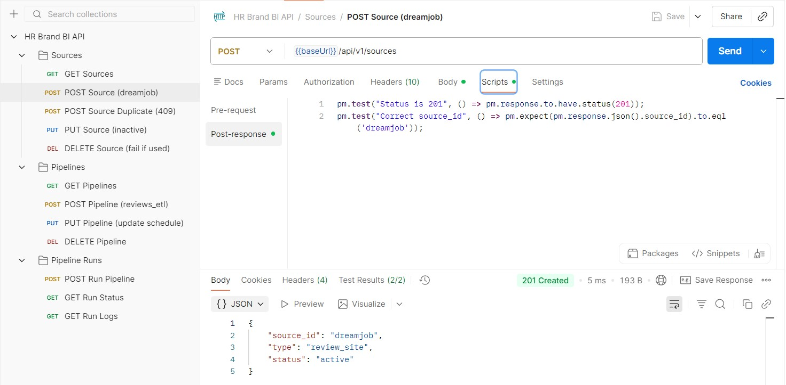
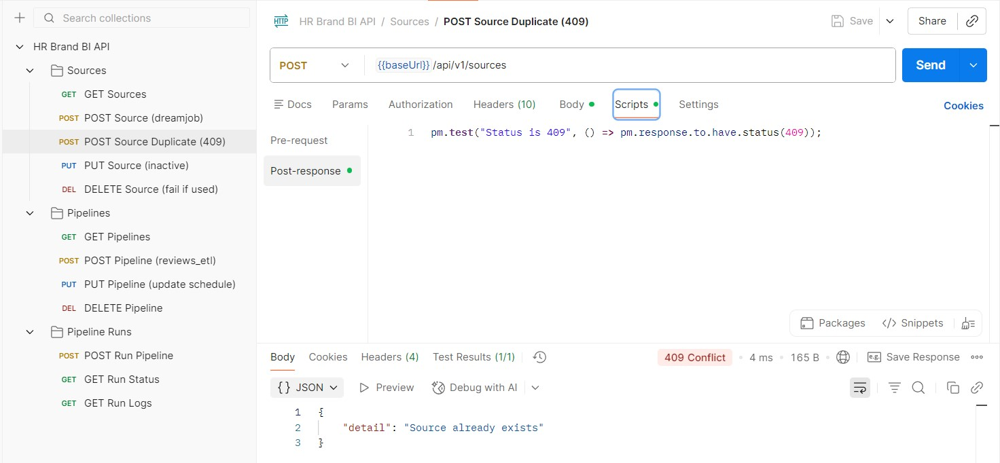

#### PUT /sources/{source_id}
**Описание:** обновить источник данных.

**Тело запроса:**
```json
{
  "status": "inactive"
}
```

**Ответ 200:**
```json
[
  {
    "source_id": "dreamjob",
    "type": "review_site",
    "status": "inactive"
  }
]
```

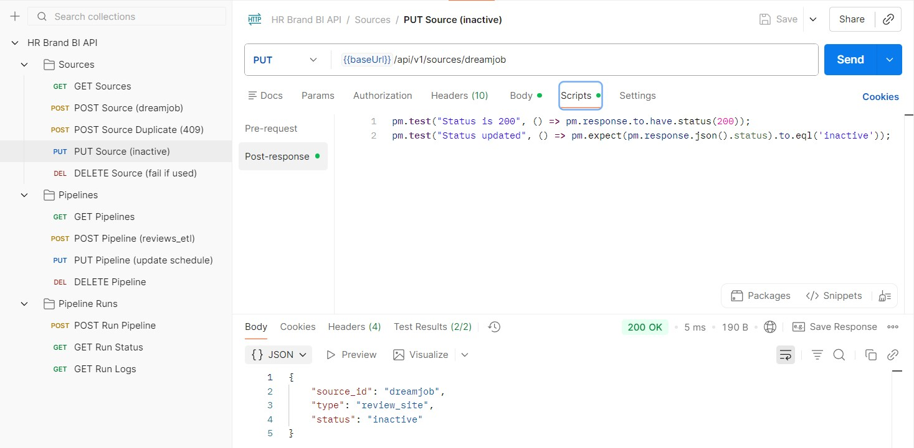

#### DELETE /sources/{source_id}
**Описание:** удалить источник данных.

* 204 No Content — удалено успешно (тела ответа нет)
*	400 — если источник используется в pipelines
*	404 — если не найден

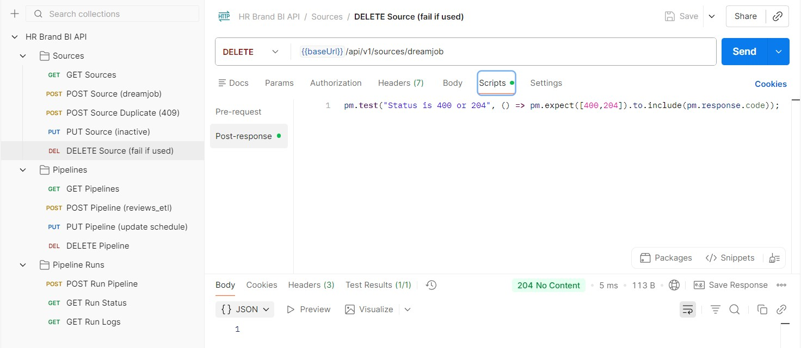

### 2) Управление ETL-пайплайнами (Pipelines)

#### GET /pipelines 
**Описание:** получить список пайплайнов.

**Ответ 200 (пример):**
```json
[
  {
    "pipeline_id": "reviews_etl",
    "sources": ["dreamjob"],
    "target": "hr_dwh",
    "schedule": null
  }
]
```

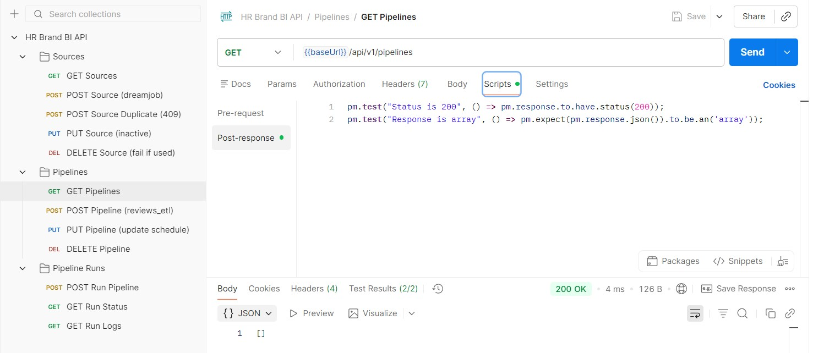

#### POST /pipelines
**Описание:** создать пайплайн.

**Тело запроса:**
```json
{
  "pipeline_id": "reviews_etl",
  "sources": ["dreamjob"],
  "target": "hr_dwh"
}
```

**Ответ 201:**
```json
{
  "pipeline_id": "reviews_etl",
  "sources": ["dreamjob"],
  "target": "hr_dwh",
  "schedule": null
}
```

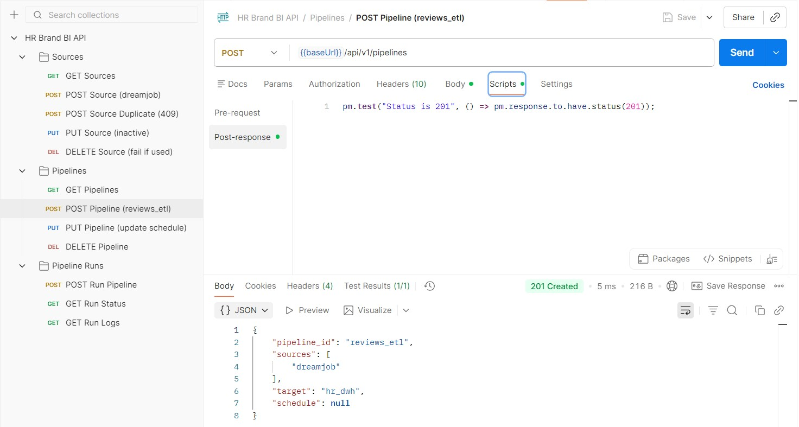

#### PUT /pipelines/{pipeline_id}
**Описание:** обновить пайплайн.

**Тело запроса:**
```json
{
  "schedule": "0 */12 * * *"
}
```

**Ответ 200:**
```json
{
  "pipeline_id": "reviews_etl",
  "sources": ["dreamjob"],
  "target": "hr_dwh",
  "schedule": "0 */12 * * *"
}
```

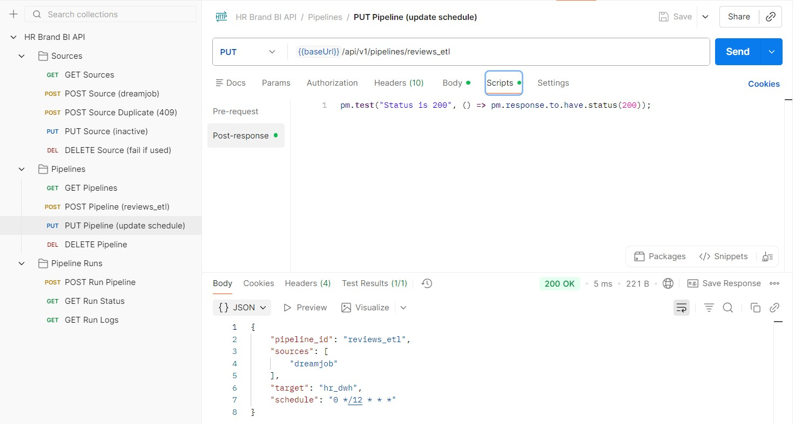

#### DELETE /pipelines/{pipeline_id}
**Описание:** удалить пайплайн.

* 204 No Content — удалено успешно (тела ответа нет)
*	404 — если не найден

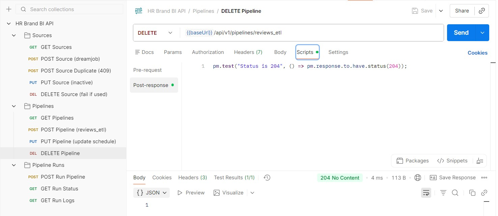

### 3) Запуск и мониторинг загрузок (Runs)

#### POST /pipelines/{pipeline_id}/runs
**Описание:** запустить пайплайн.

**Тело запроса:**
```json
{
  "params":
    {
      "period": "2025-01"
    }
}
```

**Ответ 202:**
```json
{
  "run_id": "run_01bb524b0513",
  "pipeline_id": "reviews_etl",
  "status": "success",
  "started_at": "2026-01-28T18:55:22.402227+00:00",
  "finished_at": "2026-01-28T18:55:22.402227+00:00"
}
```

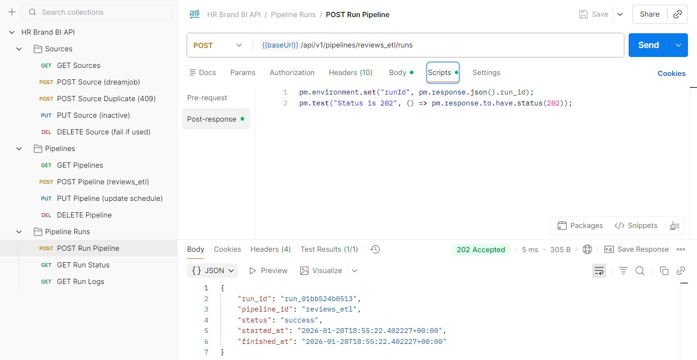

#### GET /runs/{run_id}
**Описание:** получить статус запуска.

**Ответ 200:**
```json
{
  "run_id": "run_01bb524b0513",
  "pipeline_id": "reviews_etl",
  "status": "success",
  "started_at": "2026-01-28T18:55:22.402227+00:00",
  "finished_at": "2026-01-28T18:55:22.402227+00:00"
}
```

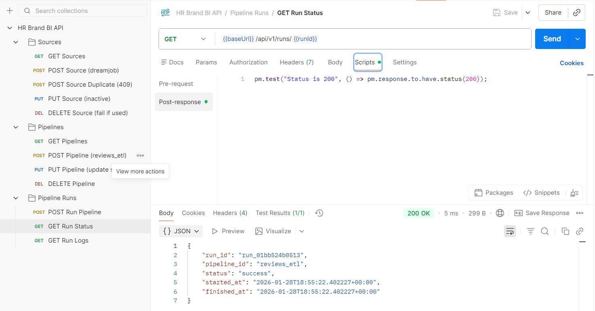

#### GET /runs/{run_id}/logs
**Описание:** получить логи запуска.

**Ответ 200:**
```json
{
  "run_id": "run_01bb524b0513",
  "logs": [
    "[...] Run created",
    "[...] Params: {...}",
    "[...] ETL completed successfully"
  ]
}
```

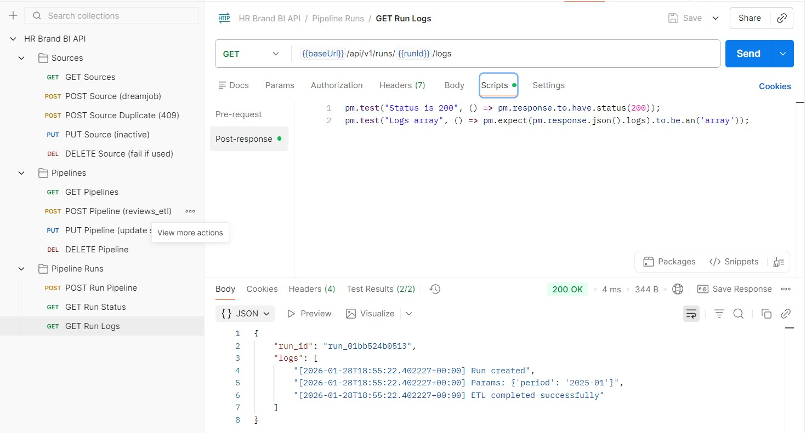

## Выводы по лабораторной работе

В ходе выполнения лабораторной работы был спроектирован и реализован REST API сервиса интеграции данных BI-системы мониторинга HR-бренда. API использует ресурсную модель, стандартные HTTP-методы (GET/POST/PUT/DELETE), единый формат ошибок и поддерживает управление конфигурациями (sources/pipelines), запуском (runs) и мониторингом (статусы и логи). Коллекция Postman покрывает все эндпоинты и учитывает зависимости между ресурсами (нельзя создать pipeline без source; нельзя удалить source, если он используется в pipeline).
